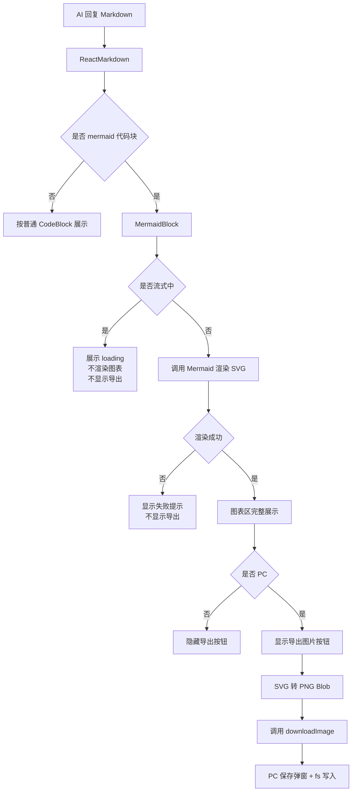
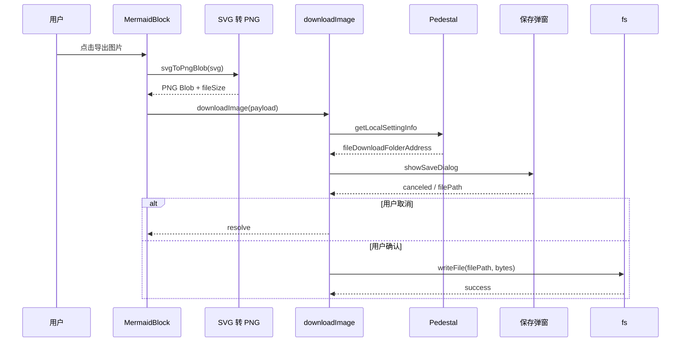

# Mermaid Markdown 渲染与图片导出技术方案（简化版）

- 方案日期：`2026-06-03`
- 目标工程：`ai-chat-viewer`
- 详细方案：[`2026-06-03-mermaid-markdown-render-export-design.md`](./2026-06-03-mermaid-markdown-render-export-design.md)

## 1. 背景

当前聊天内容已经支持 Markdown 渲染，但 ` ```mermaid ` 代码块还会按普通代码展示，用户看不到流程图、时序图等可视化结果。

本方案要做的是：在 Markdown 中识别 Mermaid 代码块，渲染成图表；流式输出期间先展示 loading，内容稳定后再渲染；PC 端支持导出图片。

非目标：

1. 不改后端接口和消息协议。
2. 不展示 Mermaid 源码。
3. 不做在线编辑、语法补全、手动缩放、拖拽平移、小地图。
4. 非 PC 端不提供导出入口。

## 2. 整体方案



核心做法：

1. 在 `markdownComponents` 中识别 `language-mermaid`，交给 `MermaidBlock` 渲染。
2. `MermaidBlock` 负责 loading、渲染、失败态、折叠、PC 导出按钮。
3. 动态状态通过 `MarkdownRuntimeConfigContext` 注入，保持 `ReactMarkdown components` 引用稳定。
4. `ToolCard` 继承父级 Context，不额外扩展 `ToolCardProps`。

## 3. 展示与流式策略

流式输出期间不调用 Mermaid 渲染，避免半截语法导致报错、闪烁和重复计算。此时图表区展示 loading 文案：`图表生成中...`。

内容稳定后再渲染 Mermaid。渲染成功后只展示图表，不展示源码。

图表展示规则：

1. 图表区固定白底。
2. 图表按容器尺寸等比缩小，保证整张图完整可见。
3. 默认只缩小超出容器的图表，小图不强制放大。
4. 不支持手动缩放、拖拽、滚轮缩放、小地图。
5. 预览缩放只影响 UI，导出仍使用原始 SVG 尺寸。

推荐尺寸约束：

```ts
scale = min(containerWidth / svgWidth, maxPreviewHeight / svgHeight, 1)
minHeight = 160px
maxPreviewHeight = min(500px, 60vh)
```

## 4. 渲染失败

渲染失败时，只影响当前 Mermaid 卡片，不影响整条消息。

失败态展示：

1. 显示提示图片。
2. 显示文案：`图表生成有问题，请重新提问试试`。
3. 不显示导出按钮。
4. 不向用户展示 Mermaid 原始错误堆栈。

需要补充 i18n：

```ts
'mermaid.renderFailed': '图表生成有问题，请重新提问试试'
'mermaid.rendering': '图表生成中...'
'mermaid.exportImage': '导出图片'
'mermaid.exportUnsupported': '当前环境不支持导出图片'
'mermaid.exportFailed': '导出图片失败'
```

## 5. 图片导出

导出只在 PC 端展示入口。非 PC 端不显示按钮。

导出流程：



组件职责：

1. `MermaidBlock` 只负责生成 PNG `Blob` 和 `fileSize`。
2. 下载动作完全交给注入的 `downloadImage`。
3. 不内置 `<a download>`、打开 URL、长按保存等兜底逻辑。

## 6. PC 文件下载公共方法

新增公共方法：

```ts
export interface PcFileDownloadPayload {
  fileStream: Blob;
  fileSize: number;
  filename: string;
  mimeType?: string;
  extensions?: string[];
}

export async function downloadFileWithPedestal(
  payload: PcFileDownloadPayload,
): Promise<void>;
```

实现规则：

1. 调用 `window.Pedestal.callMethod('method://pedestal/getLocalSettingInfo', {})` 获取默认保存目录。
2. 使用 `window.Pedestal.remote.dialog.showSaveDialog({ filters, defaultPath })` 打开保存弹窗。
3. 用户取消保存时直接成功返回，不提示失败。
4. 用户确认后，通过 `window.require('fs')` 写入文件。
5. 缺少 PC 下载能力时抛出 `unsupported`，提示 `当前环境不支持导出图片`。
6. 弹窗异常或写入失败时提示 `导出图片失败`。
7. 文件名需要清洗非法路径字符，并保证 Mermaid 导出默认是 `.png`。

Mermaid 接入方式：

```ts
const downloadMermaidImage: MermaidDownloadImageHandler = async (payload) => {
  await downloadFileWithPedestal({
    ...payload,
    extensions: ['png'],
  });
};
```

## 7. Mermaid 依赖与构建

Mermaid 是 MIT 开源库，可以商用，但需要按公司开源合规流程登记。

当前倾向使用 Mermaid 最新版，但不能直接把 `mermaid@11.15.0` 静态打进主 bundle 后就认为风险可控。

本地验证结果显示：

| 指标 | 基线 | Mermaid 11 静态引入后 |
| --- | ---: | ---: |
| `dist` 总体积 | 约 `3.9M` | 约 `7.2M` |
| JS gzip 总体积 | 约 `677 KiB` | 约 `1.53 MiB` |
| Webpack 构建耗时 | 约 `7s` | 约 `67s` 到 `84s` |

同时，最终 ES5 检查没有稳定通过，问题不只来自 Mermaid，也会牵出 Markdown、router、unified、core-js 等依赖链。

因此实施前需要先确认 Mermaid 加载策略。优先评估：

1. 动态加载。
2. 独立拆包。
3. 外部挂载。
4. 按图表类型裁剪能力。

如果仍选择静态 import，必须通过包体预算、四个构建命令和最终 ES5 产物检查。

## 8. 影响范围

直接影响：

1. Markdown 代码块渲染。
2. `MessageBubble` / `ToolCard` 中的 Markdown 内容。
3. Mermaid 新组件、样式、导出工具。
4. PC 文件下载公共方法和 Pedestal 类型补充。
5. i18n 文案。
6. Mermaid 依赖和 Webpack 构建策略。

不影响：

1. 不改后端接口。
2. 不改消息协议。
3. 不影响普通 Markdown 段落、列表、表格、数学公式。
4. 不影响非 Mermaid 代码块。
5. 不改变现有 HWH5EXT / Pedestal 协议，只补类型和公共封装。

## 9. 风险与降级

1. Mermaid 最新版静态打包体积和构建耗时风险较高，需要先确认加载策略。
2. 流式阶段不渲染 Mermaid，只展示 loading，避免错误态闪烁。
3. SVG 渲染失败只影响当前图表卡片。
4. 超大图会被缩小完整展示，文字可能变小；该情况不算渲染失败。
5. PC 下载能力缺失时提示不支持导出。
6. 用户取消保存不提示失败。
7. 保存弹窗异常、文件写入失败、canvas 安全异常时提示导出失败。

## 10. 测试范围

功能测试：

1. Mermaid 代码块能渲染成图表卡片。
2. 流式中展示 loading，不调用 Mermaid 渲染。
3. 流式结束后正常渲染。
4. 渲染失败展示提示图片和文案。
5. PC 端渲染成功后显示导出按钮。
6. 非 PC 端不显示导出按钮。
7. 图表完整展示，不需要手动缩放或拖拽。
8. ToolCard 内 Mermaid 继承父级 Context。

导出测试：

1. SVG 能转 PNG Blob。
2. 导出使用原始 SVG 尺寸，不受预览缩放影响。
3. PC 保存弹窗能打开。
4. 用户取消保存时不写文件、不提示失败。
5. 用户确认后能通过 fs 写入。
6. 缺少 PC 能力提示不支持导出。
7. 写入失败提示导出失败。

构建验证：

```bash
npm run build
npm run build:pc
npm run build:lib
npm run build:skill-cui-lib
npx es-check es5 'dist/**/*.js' 'dist/lib/**/*.js'
```

## 11. 最终建议

推荐方案：

`MermaidBlock + MarkdownRuntimeConfigContext + 自适应完整展示 + PC-only 导出 + downloadFileWithPedestal`

实施顺序：

1. 先确认 Mermaid 版本和加载策略。
2. 补 i18n、类型、SVG 转 PNG 工具。
3. 实现 PC 文件下载公共方法。
4. 实现 MermaidBlock 和样式。
5. 接入 Markdown 组件和 Context。
6. 接入 MessageBubble / ToolCard。
7. 补测试。
8. 跑构建和 ES5 检查。

## 12. 安全

1. Mermaid 使用 `securityLevel: 'strict'`。
2. 不启用 Mermaid click callback 和外部链接跳转。
3. Mermaid 渲染在本地前端完成，不上传到第三方服务。
4. 不向用户展示 Mermaid 源码和底层错误堆栈。
5. 导出文件名需要清洗。
6. PC 文件写入路径必须来自用户在系统保存弹窗中确认的 `filePath`。
7. 不允许调用方绕过保存弹窗直接传入任意目标路径。
