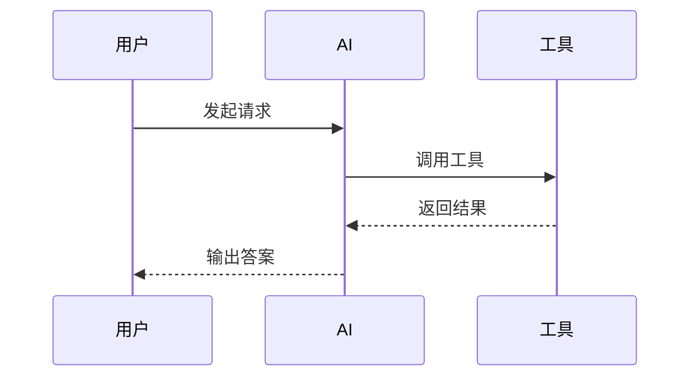
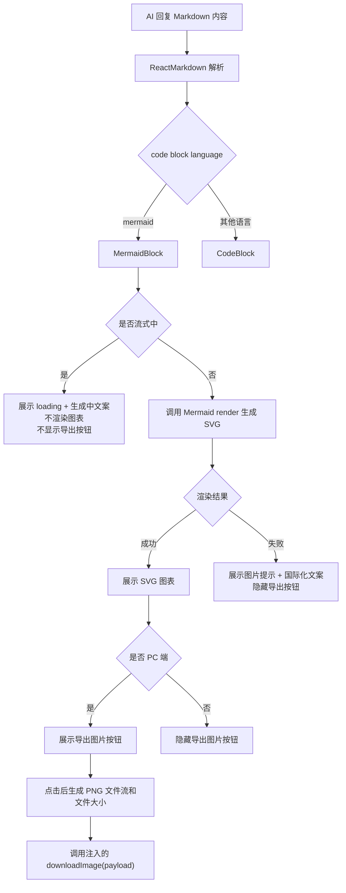
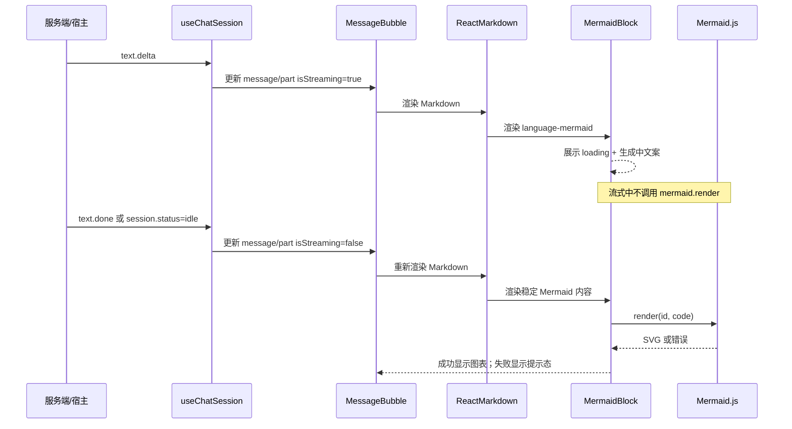
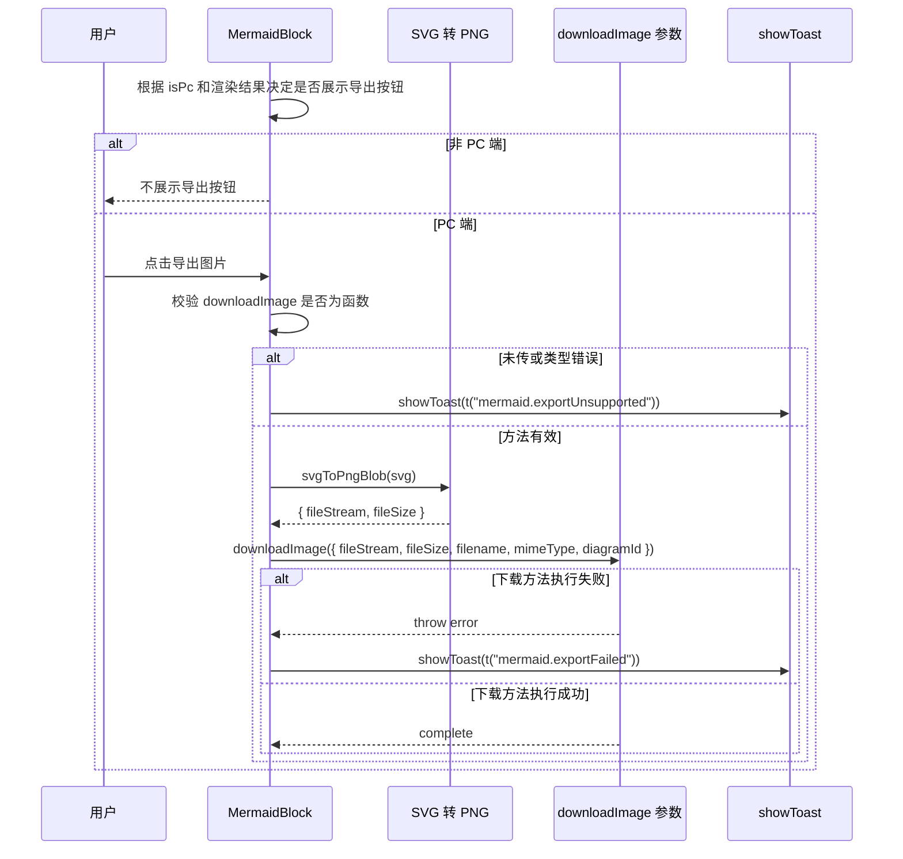

# Mermaid Markdown 渲染与图片导出技术方案

- 方案日期：`2026-06-03`
- 目标工程：`ai-chat-viewer`
- 方案类型：`前端渲染能力增强`
- 参考文档：
  - [`docs/weAgentCUI-ai-reply-rendering.md`](./weAgentCUI-ai-reply-rendering.md)
  - [`AGENTS.md`](../AGENTS.md)
  - [Mermaid GitHub Repository](https://github.com/mermaid-js/mermaid)
  - [Mermaid MIT License](https://github.com/mermaid-js/mermaid/blob/develop/LICENSE)
  - [Mermaid Usage](https://mermaid.js.org/config/usage)

## 1. 背景

### 1.1 场景说明

当前 `ai-chat-viewer` 已支持通过 `react-markdown` 渲染 Markdown 文本、代码块、表格和公式。AI 回复中可能输出如下 Mermaid 代码块：

````markdown

````

现状中该内容会被当作普通代码块展示，无法看到流程图、时序图等可视化结果。后续需要在聊天消息、工具输出等 Markdown 场景中自动识别 Mermaid 语法，只展示图表结果和必要状态，不展示 Mermaid 源码，并在 PC 端支持把图表导出为图片。

同时 AI 回复存在流式输出场景，Mermaid 代码块在输出过程中可能处于不完整状态。如果边输出边渲染，会导致频繁解析失败、页面抖动和性能浪费，因此需要对流式过程做稳定态渲染控制。

### 1.2 需求目标

1. 支持 Markdown fenced code block 中的 `mermaid` 语法渲染为图表。
2. Mermaid 展示结构采用“标题栏 + 图表区”，去掉源码区，不展示 Mermaid 原始代码。
3. 流式输出期间不触发 Mermaid 渲染，内容稳定后再渲染；流式期间展示 loading 效果和生成中文案，提示用户图表正在生成。
4. 渲染失败时显示图片加文本提示：`图表生成有问题，请重新提问试试`，并支持国际化。
5. 仅 PC 端支持导出图片；非 PC 端不显示“导出图片”按钮。
6. 图片下载方法以参数形式注入，组件只负责生成图片文件流和文件大小，不内置下载或兜底下载逻辑。
7. 未传下载方法或传入方法不是函数时，通过 toast 提示用户当前环境不支持导出。
8. 下载方法执行失败时，通过 toast 提示用户导出失败。
9. Mermaid.js 采用本地 npm 包接入，不依赖远程服务；v1 锁定 `mermaid@9.4.3`，优先保证 ES5/UMD 构建稳定。

### 1.3 非目标

1. 不新增后端接口，不改 `StreamMessage`、`SessionMessage`、`MessagePart` 协议结构。
2. 不实现 Mermaid 在线编辑器、图表语法补全、缩放小地图、PDF 导出。
3. 首期只生成 PNG 图片文件流，不导出 SVG/PDF。
4. 不接入 Mermaid Chart 等商业托管服务。
5. 不在渲染失败态向普通用户展示 Mermaid 原始错误堆栈。
6. 不为移动端、H5 WebView 提供导出入口；PC 端下载能力由外部传入方法处理。
7. 不内置 `<a download>`、打开图片 URL、长按保存等下载兜底逻辑。
8. v1 不做 Mermaid 图表暗黑主题自适配，不使用动态 `import()` 加载 Mermaid。

## 2. 方案图

### 2.1 整体方案图



### 2.2 方案核心

核心方案是在现有 Markdown code renderer 层拦截 `language-mermaid`，将其路由到新的 `MermaidBlock`。`MermaidBlock` 负责流式 loading、稳定态渲染、失败态提示和 PC 端导出按钮；源码不展示。导出时组件生成 PNG 图片文件流和文件大小，真正的下载动作完全交给外部注入的 `downloadImage` 方法。

## 3. 时序图

### 3.1 流式消息渲染时序



### 3.2 图片导出时序



## 4. 技术细节

### 4.1 调整点

1. 新增 `MermaidBlock` 组件，负责 Mermaid 流式 loading、图表展示、失败态和 PC 端导出入口。
2. 新增 Mermaid 导出转换工具，仅负责 SVG 转 PNG 图片文件流，不负责下载。
3. 扩展 `createMarkdownComponents`，识别 `language-mermaid`。
4. 新增 `MarkdownRuntimeConfigContext`，由 `MessageBubble`、`ToolCard` 通过 Provider 注入 `isStreaming`、`isPc` 与 `downloadImage`，避免动态重建 `ReactMarkdown components`。
5. 新增 Mermaid 相关 i18n 文案。
6. 新增 Mermaid 样式文件，复用现有 `CodeBlock` 的标题栏、折叠、按钮和暗黑模式设计语言，但不展示源码区。
7. 流式 loading 优先复用现有三点 pulse 效果；如果现有样式作用域无法直接复用，则在 `MermaidBlock` 样式中新增命名空间内的三点 loading，视觉效果与现有 `.loading-dot` 保持一致。
8. `package.json` 增加并锁定 `mermaid@9.4.3` 依赖。
9. `webpack.shared.js` 增加 `mermaid$` alias，指向 `mermaid/dist/mermaid.min.js`，优先使用 Mermaid 9 的 UMD/CJS 兼容入口。
10. v1 不采用动态 `import()`，减少 UMD library 异步 chunk 路径风险；如果后续升级 Mermaid 10+，需单独评估 ESM 转译和分包加载策略。

### 4.2 核心实现方式

#### 4.2.1 组件结构

`MermaidBlock` 结构如下：

```tsx
<div className="mermaid-block">
  <div className="mermaid-block__header">
    <button className="mermaid-block__toggle">mermaid + arrow</button>
    <div className="mermaid-block__actions">
      {isPc && renderSuccess ? <button>{t('mermaid.exportImage')}</button> : null}
    </div>
  </div>
  {!collapsed ? (
    <div className="mermaid-block__preview">
      {isStreaming ? <MermaidLoading /> : renderSuccess ? svg : failureState}
    </div>
  ) : null}
</div>
```

图表区在标题栏下方展示，白底居中，大图横向滚动。组件内部仍保留 Mermaid 原始字符串用于渲染，但不在 UI 上展示源码，也不提供源码复制按钮。

`MermaidLoading` 设计：

1. 优先抽取并复用 `Content.less` 中 `.loading-dot` 的三点 pulse 动画，形成可在 Mermaid 卡片内使用的轻量 loading。
2. 若现有 `.loading-dot` 强依赖页面作用域，则新增 `.mermaid-block__loading`、`.mermaid-block__loading-dot`、`.mermaid-block__loading-text`，动画参数与现有 `loading-pulse` 保持一致。
3. 文案使用 `t('mermaid.rendering')`，中文为 `图表生成中...`，英文为 `Generating chart...`。
4. loading 只出现在 `isStreaming=true` 的 Mermaid 图表区，不展示导出按钮，也不调用 `mermaid.render()`。

#### 4.2.2 Markdown 运行时配置

`createMarkdownComponents(true)` 必须保持静态引用，不接收 `isStreaming`、`isPc`、`downloadImage` 等动态参数。原因是 `ReactMarkdown` 的 `components` 引用变化会导致内部 Markdown 渲染器整体重挂载，在流式场景中可能造成卡顿、闪烁和用户选择态丢失。

新增轻量 Context 传递 Mermaid 运行时配置：

```ts
export interface MermaidDownloadImagePayload {
  fileStream: Blob;
  fileSize: number;
  filename: string;
  mimeType: 'image/png';
  diagramId: string;
}

export type MermaidDownloadImageHandler = (
  payload: MermaidDownloadImagePayload,
) => Promise<void> | void;

export interface MarkdownRuntimeConfig {
  isStreaming?: boolean;
  isPc?: boolean;
  downloadImage?: MermaidDownloadImageHandler;
}

export const MarkdownRuntimeConfigContext = React.createContext<MarkdownRuntimeConfig>({});
```

使用方式：

```tsx
const markdownComponents = useMemo(() => createMarkdownComponents(true), []);
const runtimeConfig = useMemo(
  () => ({ isStreaming, isPc, downloadImage }),
  [isStreaming, isPc, downloadImage],
);

<MarkdownRuntimeConfigContext.Provider value={runtimeConfig}>
  <ReactMarkdown components={markdownComponents}>
    {normalizeMarkdownHtml(content)}
  </ReactMarkdown>
</MarkdownRuntimeConfigContext.Provider>
```

兼容与约束：

1. `createMarkdownComponents(true)` 继续等价于 `{ includeCodeBlock: true }`。
2. `language-mermaid` 返回 `MermaidBlock`，`MermaidBlock` 内部通过 `useContext(MarkdownRuntimeConfigContext)` 获取运行时配置。
3. 非 Mermaid 代码块继续返回 `CodeBlock`。
4. `MessageBubble`、`ToolCard` 中 `markdownComponents` 继续使用空依赖 `useMemo`，避免流式过程中重建 renderer。
5. `MarkdownRuntimeConfigContext.Provider` 的 `value` 必须使用 `useMemo` 缓存，避免父组件普通重渲染时制造新对象引用，导致多个 `MermaidBlock` 无意义 re-render。

#### 4.2.3 流式状态传递

`MessageBubble` 在渲染 `part.content` 时计算运行时状态：

```ts
isStreaming: Boolean(part.isStreaming || message.isStreaming)
```

无 `parts` 回退渲染 `message.content` 时传入：

```ts
isStreaming: Boolean(message.isStreaming)
```

这些状态通过 `MarkdownRuntimeConfigContext.Provider` 注入给当前 `ReactMarkdown`，不作为 `createMarkdownComponents` 的参数。

`ToolCard` 中 `input/output/error` 的 Markdown 需要继续支持 Mermaid。v1 不新增 `ToolCardProps` 的 `isPc`、`downloadImage` 字段，避免接口扩散。实现时 `ToolCard` 内部读取父级 `MarkdownRuntimeConfigContext`，用 `useMemo` 合并父级 `isPc/downloadImage`，并用 `part.status === 'running' || part.isStreaming` 覆盖 `isStreaming`。这样 Tool 输出中的 Mermaid 在 PC 端仍可复用父级下载能力，running 状态展示 Mermaid loading。

`ThinkingBlock` 首期不启用 Mermaid 渲染，避免思考过程流式频繁重绘。

#### 4.2.4 Mermaid 渲染

使用 Mermaid 本地包：

```ts
mermaid.initialize({
  startOnLoad: false,
  securityLevel: 'strict',
  theme: 'default',
});
```

v1 固定使用浅色 `default` 主题，图表预览区和导出图片均使用白底。暗黑模式只适配 Mermaid 卡片标题栏、按钮、loading 和失败态，不改变 Mermaid 图表主题，避免暗黑主题图表在白底上出现文字或线条不可读。

渲染流程：

1. `isStreaming=true` 时展示 loading 效果和 `mermaid.rendering` 文案，不调用 `mermaid.render()`。
2. `isStreaming=false` 且 `code.trim()` 非空时渲染。
3. 使用 `React.useId()` 生成实例级 id。由于 React 18 的 `useId()` 可能生成 `:r0:` 这类包含冒号的值，必须清洗掉冒号和其他特殊字符，只保留 `[A-Za-z0-9_-]`，最终输出 `mermaid-chart-${safeId}`，避免同一 message/part 内多个 Mermaid 块发生 `diagramId` 冲突。
4. 使用递增 render token，丢弃过期异步渲染结果。
5. 以 `code + theme` 为 key 缓存 SVG，v1 中 `theme` 固定为 `default`。缓存采用模块级 LRU，最大 50 条，超出后淘汰最久未访问项，避免长会话中 SVG 字符串无限增长。
6. Mermaid 源码只作为渲染输入，不作为 UI 文本展示。

#### 4.2.5 失败态

渲染失败时：

1. `WeLog` 记录错误摘要。
2. 图表区展示 `src/imgs/warn_icon.svg`。
3. 文案展示 `t('mermaid.renderFailed')`。
4. 隐藏“导出图片”按钮。
5. 不展示 Mermaid 源码和解析错误详情。

文案：

```ts
'mermaid.renderFailed': '图表生成有问题，请重新提问试试'
'mermaid.exportImage': '导出图片'
'mermaid.exportFailed': '导出图片失败'
'mermaid.exportUnsupported': '当前环境不支持导出图片'
'mermaid.rendering': '图表生成中...'
```

英文：

```ts
'mermaid.renderFailed': 'There was a problem generating the chart. Please try asking again.'
'mermaid.exportImage': 'Export image'
'mermaid.exportFailed': 'Failed to export image'
'mermaid.exportUnsupported': 'Image export is not supported in this environment.'
'mermaid.rendering': 'Generating chart...'
```

#### 4.2.6 SVG 转 PNG 文件流

`svgToPngBlob(svgElement)` 只负责把已渲染的 SVG 转为 PNG `Blob`，不执行下载动作。

实现要求：

1. 通过 `XMLSerializer` 序列化当前 SVG 节点，确保 SVG 内部 `<style>` 标签被完整保留，避免导出图片丢失颜色、线宽、字体等 Mermaid 样式。
2. PNG 输出固定白底；绘制 SVG 前先用 `#ffffff` 填充 canvas。
3. 使用 `window.devicePixelRatio || 1` 计算 canvas 物理像素尺寸，绘制前执行 `ctx.scale(dpr, dpr)`，避免 Retina 屏幕导出模糊。
4. 设置最大宽高限制，大图按比例缩放，避免 canvas 过大导致内存峰值过高。
5. 使用 `HTMLImageElement.onload` 后再绘制 SVG，并设置 5 秒超时；超时未加载完成时主动 reject。
6. 捕获 canvas taint、`SecurityError`、图片加载失败和 `canvas.toBlob(null)`，统一抛出可被 `MermaidBlock` 捕获的导出失败错误。
7. 转换完成后释放临时 object URL、canvas 引用和 image 引用。
8. 成功时返回 `{ fileStream: blob, fileSize: blob.size }`，再由 `downloadImage` 接管下载。
9. SVG 缓存为模块级 LRU，不随单个组件卸载清空；组件卸载时只需清理自身临时资源和异步任务。

#### 4.2.7 Mermaid 依赖与构建

当前工程需要同时支持页面 bundle、PC bundle 和 UMD library，Webpack 目标为 ES5。Mermaid 最新版本为 ESM 包，对当前 UMD/ES5 构建链路风险较高，因此 v1 采用兼容优先策略：

1. `package.json` 锁定 `mermaid@9.4.3`。
2. `webpack.shared.js` 增加 `resolve.alias`：

```js
alias: {
  mermaid$: 'mermaid/dist/mermaid.min.js',
}
```

3. 业务代码仍从 `mermaid` 导入，避免实现层依赖具体 dist 路径。
4. 实施第一步先检查 `mermaid/dist/mermaid.min.js` 的语法级别：

```bash
npx acorn --ecma5 node_modules/mermaid/dist/mermaid.min.js
```

5. 如果 ES5 检查失败，需要将 `mermaid` 加入 `webpack.shared.js` 的 `TRANSPILE_DEPENDENCIES`，再执行构建验证。
6. v1 不使用动态 `import()`；若后续要升级 Mermaid 10+ 或 11+，需重新评估 ESM 转译、`TRANSPILE_DEPENDENCIES`、异步 chunk publicPath 和 UMD 外部消费方式。

### 4.3 兼容与边界

1. 只识别标准 fenced code block：` ```mermaid `。
2. `mermaid` 语言名大小写不敏感。
3. 流式中不渲染 Mermaid，只展示 loading 效果，避免半截语法导致错误态闪烁。
4. 渲染失败不影响整条消息展示，失败范围限定在当前 Mermaid 卡片。
5. 导出按钮只在 PC 端且 SVG 成功生成后展示。
6. 非 PC 端不支持导出，也不显示导出按钮。
7. PC 端点击导出时，如果 `downloadImage` 未传或不是函数，提示 `mermaid.exportUnsupported`。
8. PC 端点击导出时，如果 `downloadImage` 执行失败，提示 `mermaid.exportFailed`。
9. 导出处理中按钮禁用，避免重复触发。
10. 下载动作完全由传入的 `downloadImage` 负责，组件不实现 `<a download>`、打开 URL、长按保存等兜底逻辑。
11. 大图表需要横向滚动，不能撑破聊天气泡。
12. Canvas 转换 PNG 文件流时需要控制最大尺寸，避免内存峰值过高。
13. loading 动画只在当前 Mermaid 块处于流式状态时展示；如果用户折叠卡片，则停止展示图表区 loading。
14. `ReactMarkdown components` 引用必须稳定；动态运行时配置只通过 `MarkdownRuntimeConfigContext` 传递。
15. v1 固定 Mermaid 浅色主题和白底图表，不随暗黑模式切换图表主题。
16. 同一消息或同一 part 内允许出现多个 Mermaid 块，`diagramId` 使用 `useId()` 生成，不能只依赖 `message.id + part.partId`。

### 4.4 相关接口联动

本方案不新增后端接口，但新增前端可选接口：

```ts
export interface MermaidDownloadImagePayload {
  fileStream: Blob;
  fileSize: number;
  filename: string;
  mimeType: 'image/png';
  diagramId: string;
}

export type MermaidDownloadImageHandler = (
  payload: MermaidDownloadImagePayload,
) => Promise<void> | void;
```

接入点：

1. `MessageBubbleProps` 可新增可选字段 `downloadMermaidImage?: MermaidDownloadImageHandler`。
2. `ContentProps` 可新增可选字段 `downloadMermaidImage?: MermaidDownloadImageHandler`，向下透传到 `MessageBubble`。
3. `MarkdownRuntimeConfigContext` 接收 `isStreaming`、`isPc` 和 `downloadImage`。
4. `createMarkdownComponents(true)` 只负责创建静态 Markdown component map，不接收运行时配置。
5. PC 判定统一从页面层传入或复用现有 `isPcMiniApp()` 结果，避免 `MermaidBlock` 内部自行判断宿主。
6. 组件内部提供 `svgToPngBlob(svg)` 能力，输出 `Blob` 和 `blob.size`，再调用业务传入的下载方法。

如果未来 PC 宿主能力支持保存图片，可在页面层传入：

```ts
const downloadMermaidImage: MermaidDownloadImageHandler = async ({
  fileStream,
  fileSize,
  filename,
  mimeType,
}) => {
  await hostDownloadImage({
    fileStream,
    fileSize,
    filename,
    mimeType,
  });
};
```

### 4.5 文档需要同步修改的内容

1. 更新 `docs/weAgentCUI-ai-reply-rendering.md`，补充 `text` Markdown 中 Mermaid 代码块的渲染规则。
2. 更新 `docs/weAgentCUI-opencode-cases.md`，新增 Mermaid 渲染、PC 导出、非 PC 隐藏导出验证 case。
3. 更新 `AGENTS.md`，在高风险渲染区补充 Mermaid 流式、PC-only 导出、下载方法注入、Context 配置传递和 Mermaid 版本锁定注意事项。
4. 如项目维护依赖清单或开源合规清单，需要登记 `mermaid` 及 MIT License。

## 5. 性能

1. Mermaid 渲染只在内容稳定后执行，避免流式过程中每个 token 都触发解析和 SVG 布局。
2. 流式 loading 使用轻量三点 CSS 动画，不引入额外图片或 JS 定时器。
3. v1 锁定 `mermaid@9.4.3` 并采用静态 import，优先保证 ES5/UMD 构建稳定；暂不使用动态 `import()`，避免 library 场景异步 chunk 加载路径不稳定。
4. 使用 `code + theme` 缓存 SVG，避免历史消息、折叠展开、父组件重渲染时重复计算。
5. 使用 render token 防止异步结果乱序覆盖。
6. 图片导出只在 PC 端用户点击时执行，不占用普通渲染路径性能。
7. Canvas 转 PNG 文件流按设备像素比提升清晰度，但设置最大宽高和 5 秒加载超时，避免大图或异常 SVG 导致内存峰值过高或按钮长期禁用。
8. 组件只生成 `Blob` 和 `Blob.size`，不执行下载动作，减少浏览器兼容分支和额外资源保留时间。
9. 多个 Mermaid 图同时出现时，不做全局批量同步渲染；每个 `MermaidBlock` 独立渲染，后续可按需要增加视口内懒渲染。
10. `ReactMarkdown components` 引用保持稳定，动态状态变化不会触发整棵 Markdown 子树重挂载。
11. `MarkdownRuntimeConfigContext.Provider` 的 value 使用 `useMemo`，减少无关重渲染。
12. SVG 缓存采用 50 条 LRU 上限，控制长会话内存占用。

## 6. 功耗

1. 不新增轮询、长连接或后台任务。
2. 不在流式阶段持续执行 Mermaid 解析，降低 CPU 持续占用。
3. loading 动画仅在 Mermaid 块流式输出期间展示，内容稳定或卡片折叠后停止。
4. 导出图片为 PC 用户主动触发的一次性计算，完成后释放临时 object URL、canvas 和图片引用。
5. 非 PC 端不展示导出入口，避免移动端大图转换带来的额外 CPU、内存和功耗消耗。

## 7. 影响范围

### 7.1 直接影响

1. `src/components/markdownComponents.tsx`
2. `src/components/MessageBubble.tsx`
3. `src/components/ToolCard.tsx`
4. 新增 Mermaid 组件、样式、导出工具和类型定义。
5. `src/i18n/resources/zh.ts`、`src/i18n/resources/en.ts`
6. `package.json`、`webpack.shared.js`

### 7.2 间接影响

1. Markdown 渲染链路中的代码块展示。
2. WeAgentCUI 和 SkillCUI 中 assistant/tool Markdown 内容展示。
3. UMD library 构建体积、Mermaid alias 和 ES5 构建兼容性。
4. Mermaid 卡片内部 loading 样式复用或新增命名空间样式。
5. Markdown runtime context 配置传递。
6. ToolCard 内部 Context 继承与 `isStreaming` 覆盖逻辑。
7. Jest 测试中需要 mock Mermaid、canvas 转换能力、LRU 缓存和 `downloadImage` 注入函数。
8. PC 端导出入口与非 PC 端隐藏逻辑。

### 7.3 不影响

1. 不影响 `HWH5EXT`、`Pedestal` 现有协议。
2. 不影响后端会话、消息、历史接口。
3. 不影响普通 Markdown 段落、列表、表格、数学公式渲染。
4. 不影响非 Mermaid 代码块的 `CodeBlock` 展示与复制能力。
5. 不影响创建个人助理、助手选择、助手详情等页面业务流程。

## 8. 实现风险与降级

1. Provider value 如果不使用 `useMemo`，父组件普通重渲染会制造新的 Context value 引用，导致同一 Markdown 中的多个 `MermaidBlock` 发生额外 re-render。实现时必须缓存 runtime config。
2. `mermaid$` alias 指向 `mermaid/dist/mermaid.min.js` 后仍可能存在 ES5 语法兼容风险。实施第一步需要运行 acorn ES5 检查；如检查失败，将 `mermaid` 加入 `TRANSPILE_DEPENDENCIES` 后再验证构建。
3. SVG 缓存如果使用无限 Map，长会话中可能累积较多 SVG 字符串。v1 采用 50 条 LRU 上限，超出后淘汰最久未访问项。
4. `ToolCard` 不新增对外 props，内部通过父级 `MarkdownRuntimeConfigContext` 继承 `isPc/downloadImage`，仅覆盖 `isStreaming`。如果 ToolCard 没有父级配置，则按默认非 PC/无下载方法处理。
5. 图片导出过程中任何转换失败、超时、canvas 安全异常或下载方法异常，都统一走 toast 提示，不阻断消息正文展示。

## 9. 测试范围

### 9.1 功能测试

1. assistant 消息中 ` ```mermaid ` 成功渲染为卡片结构。
2. 卡片顶部展示 `mermaid` 和折叠按钮，不展示源码复制按钮。
3. 展开态只展示图表区，不展示源码区。
4. PC 端渲染成功后显示“导出图片”按钮。
5. 渲染失败后显示 `warn_icon.svg` + `图表生成有问题，请重新提问试试`，不显示导出按钮。
6. 流式过程中不触发 Mermaid 渲染，展示 loading 效果和 `图表生成中...` 文案，不显示导出按钮。
7. 流式结束后触发 Mermaid 渲染。
8. 非 PC 端渲染成功后不显示“导出图片”按钮。
9. PC 端点击导出图片时成功生成 PNG `Blob`，并向 `downloadImage` 传入 `fileStream` 与 `fileSize`。
10. PC 端未传 `downloadImage` 或传入值不是函数时，toast 提示 `当前环境不支持导出图片`。
11. `downloadImage` 执行失败时，toast 提示 `导出图片失败`。
12. 普通代码块仍显示为原 `CodeBlock`。
13. 同一条消息或同一 part 中多个 Mermaid 块都能正常渲染，且 `diagramId` 不冲突。
14. 动态切换 `isStreaming`、`isPc`、`downloadImage` 时，`ReactMarkdown components` 引用不重建。
15. ToolCard 内 Mermaid 能继承父级 `isPc/downloadImage`，并按 tool running 状态展示 loading。
16. SVG 缓存超过 50 条时淘汰最久未访问项。

### 9.2 兼容测试

1. Chrome / Safari PC 环境基础渲染和导出。
2. PC miniapp 环境的导出按钮、PNG 文件流生成和 `downloadImage` 调用。
3. 非 PC WebView 中不显示导出按钮。
4. iOS / Android / Harmony WebView 的 SVG 渲染和失败态展示。
5. 暗黑模式下标题栏、loading 态、失败态和按钮可读性；图表区固定白底，Mermaid 图表保持浅色主题并可读。
6. UMD library 构建后由外部页面消费时 Mermaid 依赖加载是否正常。
7. 构建验证必须覆盖 `npm run build`、`npm run build:pc`、`npm run build:lib`、`npm run build:skill-cui-lib`。
8. Mermaid dist 需要先通过 `npx acorn --ecma5 node_modules/mermaid/dist/mermaid.min.js` 检查；若失败，需验证加入 `TRANSPILE_DEPENDENCIES` 后构建通过。

### 9.3 文档一致性检查

1. `weAgentCUI-ai-reply-rendering.md` 中 Markdown 渲染链路与实现一致。
2. `weAgentCUI-opencode-cases.md` 中测试 case 覆盖 Mermaid 成功、失败、PC 导出和非 PC 隐藏导出。
3. `AGENTS.md` 中新增依赖、Markdown 风险、PC-only 导出、下载方法注入、Context 配置传递和构建验证说明。
4. 开源合规文档登记 Mermaid MIT License。

## 10. 最终建议

推荐采用“MermaidBlock 专用组件 + PC-only 导出入口 + 图片文件流下载方法注入”的方案。

原因：

1. 改动收口在 Markdown 展示层，不影响协议和后端。
2. 同时满足图表展示、失败态和 PC 端图片导出。
3. 流式期间不渲染 Mermaid，但用轻量 loading 给用户明确反馈，能降低性能抖动和错误闪烁，同时避免空白等待。
4. 下载方法参数注入后，下载动作由业务侧统一处理，`MermaidBlock` 不需要承载端差异和下载兜底逻辑。
5. `MarkdownRuntimeConfigContext` 能保证 `ReactMarkdown components` 引用稳定，降低流式阶段整体重挂载风险。
6. Provider value 使用 `useMemo`、ToolCard 继承父级 Context、SVG LRU 上限和 Mermaid ES5 预检能进一步降低实施阶段风险。
7. `mermaid@9.4.3` 更适合当前 ES5/UMD 构建目标；Mermaid.js 是 MIT 开源库，可用于商业产品，上线前按公司开源合规流程登记依赖即可。

推荐实施顺序：

1. 增加 i18n、类型和 SVG 转 PNG 文件流 helper。
2. 实现 `MermaidBlock` 与样式，优先复用现有三点 loading 效果。
3. 新增 `MarkdownRuntimeConfigContext`，Provider value 使用 `useMemo`，保持 `createMarkdownComponents(true)` 静态引用。
4. 接入 `markdownComponents.tsx`，识别 `language-mermaid`。
5. 通过 Provider 传递流式状态、PC 判定和下载 handler；ToolCard 继承父级 Context 并覆盖自身 `isStreaming`。
6. 锁定 `mermaid@9.4.3` 并配置 Webpack `mermaid$` alias。
7. 对 Mermaid dist 执行 ES5 语法检查，必要时加入 `TRANSPILE_DEPENDENCIES`。
8. 补齐单测和文档。
9. 运行测试与构建验证。

## 11. 安全

1. Mermaid 使用 `securityLevel: 'strict'`，默认禁用不安全交互能力。
2. 不启用 Mermaid click callback、外部链接跳转等交互能力。
3. Mermaid 源码和 SVG 渲染均在本地前端执行，不上传到第三方服务，也不在 UI 上展示 Mermaid 源码。
4. 渲染失败不向用户暴露底层错误堆栈，避免泄露内部实现细节。
5. SVG 转 PNG 时不引入外部图片资源，降低 canvas taint 风险；若仍触发 `SecurityError`，需捕获并提示导出失败。
6. 传给 `downloadImage` 的文件名使用固定前缀和安全字符，避免注入特殊路径字符。
7. 传给 `downloadImage` 的内容限定为 PNG `Blob`、文件大小和必要元信息，不传 Mermaid 源码。
8. `diagramId` 由 `useId()` 生成并清洗，避免用户内容参与 DOM id 拼接。
9. 现有 Markdown 链路已使用 `rehypeRaw`，本次不扩大 raw HTML 能力；如后续安全要求提升，应单独评估 HTML sanitize。
10. MIT License 允许使用、复制、修改、分发和销售，但需要保留版权和许可声明；公司发版前需按开源合规流程登记。

## 12. 单元测试

### 12.1 `MermaidBlock` 单测

1. `isStreaming=true` 时不调用 Mermaid render。
2. `isStreaming=true` 时展示三点 loading 和 `mermaid.rendering` 文案。
3. `isStreaming=false` 且代码合法时调用 Mermaid render，并展示 SVG。
4. Mermaid render 抛错时展示 `warn_icon.svg` 和 `mermaid.renderFailed`。
5. 渲染失败时不展示导出按钮。
6. PC 端渲染成功时展示导出按钮。
7. 非 PC 端渲染成功时不展示导出按钮。
8. UI 中不展示 Mermaid 源码区和源码复制按钮。
9. PC 端点击导出按钮时调用传入的 `downloadImage`。
10. `downloadImage` 未传或类型错误时调用 `showToast(t('mermaid.exportUnsupported'))`。
11. `downloadImage` 抛错时调用 `showToast(t('mermaid.exportFailed'))`。
12. 折叠按钮能隐藏图表区和 loading 态。
13. Mermaid 初始化参数包含 `startOnLoad: false`、`securityLevel: 'strict'`、`theme: 'default'`。
14. 同一消息或同一 part 内多个 Mermaid 块生成不同 `diagramId`。
15. 暗黑模式下图表预览区仍为白底，图表内容保持浅色主题可读。

### 12.2 `markdownComponents` 单测

1. `language-mermaid` 返回 `MermaidBlock`。
2. `language-ts` / `language-js` 等普通代码块仍返回 `CodeBlock`。
3. 旧调用 `createMarkdownComponents(true)` 行为兼容。
4. `createMarkdownComponents(true)` 不接收动态 Mermaid 配置。
5. `MarkdownRuntimeConfigContext` 能透传 `isStreaming`、`isPc` 和 `downloadImage`。
6. 动态修改 Context value 时，`components` 引用保持稳定，不触发整棵 Markdown 子树重挂载。
7. Provider value 通过 `useMemo` 缓存，父组件无关重渲染时不制造新的 runtime config 引用。

### 12.3 `MessageBubble` 回归单测

1. assistant 消息中的 Mermaid 代码块按卡片结构展示。
2. 流式 assistant 消息中的 Mermaid 不渲染图表，但展示 loading 态。
3. 历史 assistant 消息中的 Mermaid 直接进入稳定渲染。
4. 同一 text part 内多个 Mermaid 代码块都能渲染，且互不覆盖。
5. ToolCard 内 Mermaid 继承父级 `isPc/downloadImage`，并按 `part.status === 'running' || part.isStreaming` 展示 loading。
6. ToolCard 不新增 `isPc`、`downloadImage` 对外 props。
7. 普通 Markdown 段落、列表、代码块、权限卡片、问题卡片不回归。

### 12.4 导出工具单测

1. SVG 转 PNG 成功路径。
2. `canvas.toBlob` 返回空时抛错。
3. 转换结果返回 PNG `Blob` 和 `blob.size`。
4. 不创建 `<a download>`，不打开图片 URL，不做下载兜底。
5. 结束后释放临时 object URL。
6. 大图按最大尺寸限制缩放。
7. SVG 内部 `<style>` 在序列化结果中保留。
8. 使用 `window.devicePixelRatio` 绘制高清 PNG。
9. 导出 PNG 使用白底。
10. 图片加载超过 5 秒时 reject。
11. canvas taint 或 `SecurityError` 会 reject，并由 `MermaidBlock` 提示导出失败。
12. SVG 缓存超过 50 条时淘汰最久未访问项。

### 12.5 构建验证

1. `npm run build`
2. `npm run build:pc`
3. `npm run build:lib`
4. `npm run build:skill-cui-lib`
5. `npx acorn --ecma5 node_modules/mermaid/dist/mermaid.min.js`
6. 验证 `mermaid@9.4.3` 和 `mermaid$` alias 在 UMD/ES5 构建中可用；若 acorn ES5 检查失败，验证加入 `TRANSPILE_DEPENDENCIES` 后构建通过。
