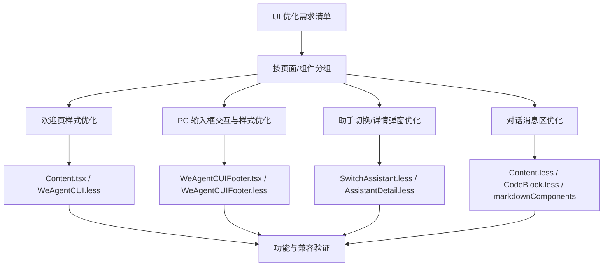

# WeAgentCUI UI 优化技术方案

- 方案日期：`2026-06-04`
- 目标工程：`ai-chat-viewer`
- 方案类型：`前端 UI 样式与交互体验优化`
- 目标页面：`/weAgentCUI`、`/switchAssistant`、`/assistantDetail`
- 参考文档：
  - [`docs/weAgentCUI-ai-reply-rendering.md`](./weAgentCUI-ai-reply-rendering.md)
  - [`docs/weAgentCUI-mock-debug.md`](./weAgentCUI-mock-debug.md)
  - [`docs/2026-06-03-mermaid-markdown-render-export-design.md`](./2026-06-03-mermaid-markdown-render-export-design.md)
  - [`docs/plans/技术方案模板.md`](./plans/技术方案模板.md)

## 1. 背景

### 1.1 场景说明

当前 `ai-chat-viewer` 的 `WeAgentCUI` 已支持欢迎页、实时对话、历史会话、助手切换、助手详情、Markdown 渲染、结构化消息卡片和 PC/移动端分支。随着 PC 小程序场景继续完善，现有界面存在若干视觉细节与交互体验不一致的问题：

1. 欢迎页头像、标题、助手名称和助手简介层次不够清晰。
2. PC 底部输入框缺少指定阴影、聚焦边框、按钮提示和长文本输入体验。
3. 助手切换弹窗、助手详情弹窗在 PC 端宽度和字段样式需要统一为更紧凑的 320px 方案。
4. 对话消息区默认隐藏滚动条，长对话定位不够直观。
5. 消息内多种卡片存在内部背景遮挡外层圆角的风险，视觉边界不一致。
6. Markdown 代码块虽然已有 `CodeBlock` 和 `react-syntax-highlighter` 链路，但实际展示可读性需要复核并优化。

本方案只做前端 UI 和局部交互增强，不改变消息协议、JSAPI 入参出参、后端接口和库导出契约。

### 1.2 需求目标

1. 优化欢迎页视觉层次：头像增加阴影，欢迎标题字号调整，助手名称与简介拆分后分别设置样式。
2. 优化 PC 底部输入框：指定阴影、聚焦边框、小三角颜色、title 提示、停止按钮提示、超过两行后扩展到 192px，并支持输入区域滚动。
3. 优化助手切换弹窗：PC 端宽度调整到 320px，助手简介颜色调整为 `rgb(153,153,153)`。
4. 优化助手详情弹窗：PC 端宽度调整到 320px，头像改为圆形，标签圆角和 padding 调整，标题字段样式统一。
5. 优化对话页消息滚动容器：支持显示滚动条，滚动条样式为 `width: 6px`、`border-radius: 100px`、颜色 `rgba(0,0,0,0.2)`。
6. 审查并修复消息内结构化卡片圆角被内部内容遮挡的问题。
7. 修复消息气泡中代码块高亮和可读性问题，优先复用现有 `react-syntax-highlighter` 与 `CodeBlock` 组件。
8. 保持移动端现有主流程稳定，PC 专属改动不污染移动端。

### 1.3 非目标

1. 不新增后端接口，不修改 `StreamMessage`、`SessionMessage`、`MessagePart` 协议结构。
2. 不修改 `src/types/bridge`、`src/utils/hwext.ts`、`src/protocol/StreamAssembler.ts` 的桥接和协议语义。
3. 不改变 `/weAgentCUI`、`/switchAssistant`、`/assistantDetail` 的路由结构。
4. 不调整 `src/lib/index.ts` 和 `src/lib/skillCUI.ts` 的导出契约。
5. 不为移动端输入框新增多行扩展能力；本轮长文本输入扩展仅适配 PC。
6. 不引入新的代码高亮依赖；优先修复现有 `react-syntax-highlighter` 链路。
7. 不新增埋点事件；如后续需要统计 UI 使用情况，单独评估。

## 2. 方案图

### 2.1 整体方案图



### 2.2 方案核心

核心方案是按页面与组件边界收敛 UI 调整：欢迎页由 `Content` 和 `WeAgentCUI.less` 负责，PC 输入框由 `WeAgentCUIFooter` 负责，助手选择/详情弹窗分别由 `SwitchAssistant.less`、`AssistantDetail.less` 负责，对话消息区由 `Content.less`、`WeAgentCUI.less` 和 `CodeBlock` 链路负责。所有调整均保持现有数据流、路由和 JSAPI 契约不变。

## 3. 技术细节

### 3.1 调整点

#### 3.1.1 欢迎页

涉及文件：

1. `src/components/Content.tsx`
2. `src/styles/WeAgentCUI.less`

调整内容：

1. 助手头像 `.we-agent-cui-welcome__avatar-wrap` 增加阴影：

   ```css
   box-shadow: 0px 1px 6px 0px rgba(0, 0, 0, 0.08);
   ```

2. 欢迎标题 `.we-agent-cui-welcome__title` 字号调整为 `22px`。
3. 当前欢迎副标题由 `weAgentAssistantName` 和 `weAgentAssistantDescription` 拼接为单一字符串。实现时需要改为结构化渲染，保留空值过滤，但为名称和简介分别提供 class：

   - 助手名称：加粗。
   - 助手简介：颜色改为 `rgb(153,153,153)`。

#### 3.1.2 PC 底部输入框

涉及文件：

1. `src/components/assistant/WeAgentCUIFooter.tsx`
2. `src/styles/WeAgentCUIFooter.less`
3. `src/App.tsx`
4. `src/components/assistant/WeAgentHistorySidebar.tsx`

调整内容：

1. 输入框容器 `.we-agent-cui-footer` 阴影调整为：

   ```css
   box-shadow: 0px 4px 8px 0px rgba(107, 133, 235, 0.05);
   ```

2. 聚焦态 `.we-agent-cui-footer:focus-within` 边框调整为：

   ```css
   border: 1px solid rgba(107, 133, 235, 1);
   ```

3. PC 端右下角快捷键小三角 `.we-agent-cui-footer__shortcut-arrow-icon` 颜色调整为 `#cccccc`。
4. 输入框左上角两个按钮添加 `title` 属性：

   - 新建会话按钮：与 `aria-label={t('weAgent.newSession')}` 保持一致。
   - 历史会话按钮：与历史按钮现有 `aria-label` 或 i18n 文案保持一致。

5. 生成中状态的停止按钮添加 `title` 属性，与 `aria-label={t('common.stop')}` 保持一致。
6. PC 端 `.we-agent-cui-footer--pc` 需要从固定高度改为自适应高度：

   ```css
   height: auto;
   min-height: 104px;
   ```

7. PC 端 `textarea` 支持超过两行后扩展输入框整体高度。`WeAgentCUIFooter.tsx` 内部使用 `useRef<HTMLTextAreaElement | null>` 持有 textarea，并在 `value` 变化时通过 `useEffect` 重新计算高度：

   ```ts
   const nextHeight = Math.min(Math.max(textarea.scrollHeight, 44), 192);
   ```

   高度下限为 `44px`，上限为 `192px`。

   写入 `textarea.style.height` 前需要比较当前高度字符串，仅当计算值发生变化时再更新样式，避免每次输入都产生不必要的布局写入：

   ```ts
   const nextHeightValue = `${nextHeight}px`;
   if (textarea.style.height !== nextHeightValue) {
     textarea.style.height = nextHeightValue;
   }
   ```

8. PC 输入区域内容超出容器时支持滚动。Textarea 自身滚动条需要复用消息区同款 6px 细滚动条视觉，滚动条样式为：

   ```css
   width: 6px;
   border-radius: 100px;
   background: rgba(0, 0, 0, 0.2);
   ```

   实现时在 `.we-agent-cui-footer--pc .we-agent-cui-footer__input` 上补充 WebKit 与 Firefox 兼容样式，保持与消息滚动容器视觉一致：

   ```css
   .we-agent-cui-footer--pc .we-agent-cui-footer__input {
     scrollbar-width: thin;
     scrollbar-color: rgba(0, 0, 0, 0.2) transparent;
   }

   .we-agent-cui-footer--pc .we-agent-cui-footer__input::-webkit-scrollbar {
     width: 6px;
   }

   .we-agent-cui-footer--pc .we-agent-cui-footer__input::-webkit-scrollbar-track {
     background: transparent;
   }

   .we-agent-cui-footer--pc .we-agent-cui-footer__input::-webkit-scrollbar-thumb {
     border-radius: 100px;
     background: rgba(0, 0, 0, 0.2);
   }
   ```

移动端保持现有单行 `input`，不做多行扩展。

#### 3.1.3 助手切换弹窗

涉及文件：

1. `src/components/assistant/AssistantSelectionPage.tsx`
2. `src/components/assistant/AssistantCardList.tsx`
3. `src/styles/SwitchAssistant.less`

调整内容：

1. PC 端 `.switch-assistant--pc` 宽度调整为 `320px`。
2. 移动端 `.switch-assistant` 保持 `width: 100%` 和全屏承载方式。
3. 助手简介 `.switch-assistant__summary` 颜色调整为：

   ```css
   color: rgb(153, 153, 153);
   ```

#### 3.1.4 助手详情弹窗

涉及文件：

1. `src/pages/assistantDetail.tsx`
2. `src/styles/AssistantDetail.less`

调整内容：

1. PC 端 `.assistant-detail--pc` 宽度调整为 `320px`。
2. 移动端 `.assistant-detail` 保持 `width: 100%`。
3. 助手头像 `.assistant-detail__avatar` 和图片 `.assistant-detail__avatar-img` 改为圆形。
4. 助手名称旁标签 `.assistant-detail__tag` 调整为：

   ```css
   border-radius: 4px;
   padding: 2px 4px 2px 4px;
   ```

5. “助手简介”“创建者”“能力提供方”三个标题字段统一为：

   ```css
   font-size: 14px;
   font-weight: 500;
   ```

其中“助手简介”对应 `.assistant-detail__section-title`，“创建者”和“能力提供方”对应 `DetailInfoRow` 渲染出的 `.assistant-detail__info-label`。

#### 3.1.5 对话消息区

涉及文件：

1. `src/components/Content.tsx`
2. `src/components/MessageBubble.tsx`
3. `src/components/CodeBlock.tsx`
4. `src/components/markdownComponents.tsx`
5. `src/styles/Content.less`
6. `src/styles/WeAgentCUI.less`
7. `src/styles/CodeBlock.less`

调整内容：

1. 消息滚动容器 `.content--we-agent-cui` 从隐藏滚动条调整为显示滚动条。
2. 滚动条样式统一为：

   ```css
   width: 6px;
   border-radius: 100px;
   background: rgba(0, 0, 0, 0.2);
   ```

   实现时需要同时补充 WebKit 与 Firefox 兼容样式：

   ```css
   .content--we-agent-cui {
     scrollbar-width: thin;
     scrollbar-color: rgba(0, 0, 0, 0.2) transparent;
   }

   .content--we-agent-cui::-webkit-scrollbar {
     display: block;
     width: 6px;
   }

   .content--we-agent-cui::-webkit-scrollbar-track {
     background: transparent;
   }

   .content--we-agent-cui::-webkit-scrollbar-thumb {
     border-radius: 100px;
     background: rgba(0, 0, 0, 0.2);
   }
   ```

3. 审查并修复以下消息卡片的圆角裁剪：

   - `ToolCard`
   - `ThinkingBlock`
   - `QuestionCard`
   - `PermissionCard`
   - `SubtaskBlock`
   - `ErrorBlock`
   - `CodeBlock`

4. 当前代码中 `.thinking-block` 和 `.permission-card` 已有 `overflow: hidden`，但 `Content.less` 中 `.tool-card` 缺少该属性，导致 header 背景色可能溢出并遮挡外层圆角。实现时应优先在 `.tool-card` 补齐：

   ```css
   overflow: hidden;
   ```

5. 卡片圆角修复优先采用以下策略：

   - 外层卡片设置 `overflow: hidden`。
   - header/body 背景贴边时补齐对应方向的 `border-radius`。
   - 内层滚动区域避免覆盖外层圆角。
   - 不为每个卡片引入新的包裹层，除非现有 DOM 无法表达裁剪关系。

6. 代码高亮优先复用现有链路：

   - `markdownComponents.tsx` 识别 fenced code block 的 `language-*`。
   - `CodeBlock.tsx` 使用 `react-syntax-highlighter` 和 Prism style。
   - `CodeBlock.less` 调整高亮区域、背景、字体、行号、横向滚动和暗色兼容。

### 3.2 核心实现方式

1. 样式优先落在已有 Less 文件中，避免新增全局样式入口。
2. PC 专属样式使用现有 `.pc-mode`、`--pc` class 约束，避免影响移动端。
3. 欢迎副标题拆分只改变 DOM 展示结构，不改变 `ContentProps` 入参字段。实现时保留名称和简介的空值过滤：只有名称时只渲染名称，只有简介时只渲染简介，二者同时存在时再渲染分隔符，避免出现多余 `|`。
4. 输入框高度扩展在 `WeAgentCUIFooter` 内部完成。PC 分支为 textarea 增加 ref，在 `value` 变化的 `useEffect` 中先重置高度再读取 `scrollHeight`，按 `Math.min(Math.max(textarea.scrollHeight, 44), 192)` 计算目标高度；写回 `style.height` 前先比较当前值，仅高度变化时更新，并根据是否超过 `192px` 控制 `overflowY`。
5. `.we-agent-cui-footer--pc` 不再使用固定 `height: 104px`，改为 `height: auto; min-height: 104px;`，让 textarea 高度变化能自然撑开输入框整体容器。
6. 消息区滚动条样式通过 WebKit scrollbar、`scrollbar-width`、`scrollbar-color` 做兼容处理，并覆盖当前隐藏滚动条的 `display: none`、`width: 0`、`scrollbar-width: none`。
7. 代码高亮只修复现有 `CodeBlock` 渲染，不新增依赖，不改变 Markdown 解析插件列表。

### 3.3 兼容与边界

1. PC 输入框长文本扩展仅适配 `isPcMiniApp=true` 分支；移动端单行输入不改。
2. 弹窗宽度 `320px` 仅适配 PC；移动端保持宿主容器宽度。
3. 欢迎标题字号调整需处理 PC 覆盖样式，避免 mobile 与 PC 出现非预期字号冲突。
4. 消息滚动条显示只作用于 WeAgentCUI 对话消息区，不影响 SkillCUI 的滚动策略。
5. 代码块高亮依赖当前项目已安装的 `react-syntax-highlighter`；如果某些语言未被 Prism 识别，降级为纯文本代码展示，但仍保留代码块结构、复制和滚动能力。
6. 卡片圆角修复不改变卡片业务状态，不改变权限回复、问题回答、工具展开等行为。
7. 暗色模式已有移动端样式需要保留，PC 当前背景体系不新增暗色适配。

### 3.4 相关接口联动

本轮 UI 优化不新增、不修改后端接口和 JSAPI。以下接口链路保持不变：

1. `getWeAgentDetails`：仍用于获取助手名称、简介、头像、标签等信息。
2. `getWeAgentList`：仍用于助手切换弹窗列表展示。
3. `getSessionMessage` / `getSessionMessageHistory`：仍用于历史消息加载。
4. `registerSessionListener`：仍用于实时流式消息进入 `MessageBubble`。
5. `replyPermission`：仍用于权限卡片操作。
6. `createNewSession`：仍用于新建会话按钮。

实现时只允许调整这些接口返回数据的展示样式，不改变调用参数、返回值映射和错误处理语义。

### 3.5 文档需要同步修改的内容

1. 本文档作为 UI 优化方案新增到 `docs/` 目录。
2. 若后续实现中修改了代码块高亮行为，应同步补充 `docs/weAgentCUI-ai-reply-rendering.md` 中 Markdown/代码块渲染说明。
3. 若后续实现中新增 PC 输入框长文本触发 mock 或调试说明，可同步补充 `docs/weAgentCUI-mock-debug.md`。
4. 若最终实现调整范围和本文档不一致，需要回写本文档或在实现 PR 描述中标明差异。

## 4. 性能

1. 欢迎页、弹窗宽度、字体、圆角、颜色和阴影调整均为 CSS 级别变化，不增加网络请求。
2. PC 输入框高度扩展需要读取 textarea 内容高度或 `scrollHeight`。实现时应只在输入值变化时计算，避免在滚动或动画帧中频繁读写布局；写入 `textarea.style.height` 前需要判断目标高度是否与当前高度一致，只有变化时才写入，减少多余 Reflow。
3. 消息区显示滚动条不会改变消息数量和渲染模型，不引入虚拟列表。
4. 卡片圆角修复主要通过 CSS 裁剪和圆角继承实现，不增加复杂 DOM。
5. 代码高亮复用现有 `react-syntax-highlighter`，不新增依赖；需要关注大代码块渲染成本。对非常长的代码块，保持横向滚动和折叠能力，避免额外实时解析。
6. 构建产物中已包含 `react-syntax-highlighter` 转译配置；不改变 `webpack.shared.js` 的依赖转译名单，除非实现验证发现当前链路缺失。

## 5. 功耗

1. 本轮不新增轮询、长连接、后台任务或定时刷新。
2. 不新增持续动画；输入框高度变化可以使用即时布局或短过渡，但不应添加循环动画。
3. 代码高亮只在消息渲染时执行，不应在滚动过程中重复触发。
4. 滚动条显示不增加额外计算。
5. PC 输入框高度计算应由用户输入事件触发，不在空闲状态持续运行。

## 6. 影响范围

### 6.1 直接影响

1. `/weAgentCUI` 欢迎页：
   - 助手头像阴影。
   - 欢迎标题字号。
   - 助手名称和简介拆分样式。

2. `/weAgentCUI` PC 输入框：
   - 阴影、聚焦边框、小三角颜色。
   - 新建会话、历史会话、停止按钮 title。
   - 超过两行后的高度扩展和滚动条。

3. `/weAgentCUI` 对话消息区：
   - 消息滚动条可见。
   - 消息卡片圆角裁剪。
   - 代码块高亮和可读性。

4. `/switchAssistant` PC 弹窗：
   - 弹窗宽度。
   - 助手简介颜色。

5. `/assistantDetail` PC 弹窗：
   - 弹窗宽度。
   - 头像圆形。
   - 标题字段、标签样式。

### 6.2 间接影响

1. `MessageBubble` 中的 Markdown 代码块样式会影响历史消息和实时消息。
2. `CodeBlock` 如被其他页面复用，代码块高亮样式会同步变化。
3. 通用卡片样式位于 `Content.less`，需要避免影响 `SkillCUI` 下同名 class 的既有覆盖规则。
4. 滚动条可见后，PC 消息区可用内容宽度会有轻微视觉变化，需要检查长文本、表格、代码块是否仍不横向溢出页面。

### 6.3 不影响

1. 不影响服务端消息协议。
2. 不影响 JSAPI 调用参数和回调结构。
3. 不影响会话初始化、历史分页、流式消息组装、权限回复、问题回答等业务逻辑。
4. 不影响移动端输入框多行能力，因为本轮不做移动端输入框扩展。
5. 不影响库导出 API 和 UMD 包对外入口。
6. 不影响 Mermaid 渲染方案设计文档中定义的接口方向。

## 7. 测试范围

### 7.1 功能测试

1. 欢迎页空会话状态：
   - 助手头像显示阴影。
   - 欢迎标题字号符合方案。
   - 助手名称加粗，助手简介为 `rgb(153,153,153)`。
   - 仅名称、仅简介、名称和简介同时存在时均正常展示。

2. PC 底部输入框：
   - 默认态阴影符合方案。
   - 聚焦态边框为 `1px solid rgba(107,133,235,1)`。
   - 右下角小三角颜色为 `#cccccc`。
   - 新建会话、历史会话按钮有 title。
   - 生成中停止按钮有 title。
   - 输入内容超过两行后整体高度扩展，最大高度为 `192px`。
   - 内容超出输入区域后可滚动，滚动条样式符合方案。

3. 助手切换弹窗：
   - PC 宽度为 `320px`。
   - 移动端仍为全屏或宿主容器宽度。
   - 助手简介颜色为 `rgb(153,153,153)`。

4. 助手详情弹窗：
   - PC 宽度为 `320px`。
   - 助手头像为圆形。
   - “助手简介”“创建者”“能力提供方”标题字段为 `14px`、`500`。
   - 助手名称旁标签圆角为 `4px`，padding 为 `2px 4px 2px 4px`。

5. 对话消息区：
   - 长消息列表显示滚动条。
   - 滚动条宽度、圆角、颜色符合方案。
   - `ToolCard`、`ThinkingBlock`、`QuestionCard`、`PermissionCard`、`SubtaskBlock`、`ErrorBlock`、`CodeBlock` 圆角不被内部背景遮挡。
   - Markdown fenced code block 正常进入 `CodeBlock`，代码高亮可读，复制按钮可用。

### 7.2 兼容测试

1. PC miniapp 模式：
   - `/weAgentCUI`
   - `/switchAssistant`
   - `/assistantDetail`

2. 移动端 WeLink WebView：
   - 欢迎页样式不破坏布局。
   - 移动端输入框仍保持单行行为。
   - 弹窗宽度不被 PC 320px 样式污染。

3. 暗色模式：
   - 移动端已有暗色样式不被覆盖。
   - 代码块在暗色模式下仍可读。

4. 构建与测试：
   - `npm test`
   - `npm run build`
   - `npm run build:pc`

### 7.3 文档一致性检查

1. 检查本文档列出的文件与实际实现文件一致。
2. 检查 PC 专属能力是否在实现和文档中均明确为 PC 范围。
3. 检查“非目标”中声明不改的接口、协议、导出契约是否未被改动。
4. 若实现补充了代码块高亮细节，同步更新 `docs/weAgentCUI-ai-reply-rendering.md`。

## 8. 最终建议

建议按“先视觉样式、再交互增强、最后代码高亮和兼容验证”的顺序实施：

1. 第一阶段处理纯样式项：欢迎页、弹窗宽度、字体、颜色、头像、标签、阴影、边框、滚动条。
2. 第二阶段处理 PC 输入框长文本扩展，因为该项涉及组件状态、DOM 高度计算和滚动行为。
3. 第三阶段处理消息卡片圆角审查和代码块高亮，重点验证 Markdown、结构化消息和历史消息。
4. 最后统一执行测试和 PC/mobile 视觉回归。

该顺序可以降低改动耦合度，避免在未稳定样式基础时同时调整交互逻辑。

## 9. 安全

1. 本轮不新增外部脚本、远程资源或网络请求。
2. 代码高亮复用本地依赖 `react-syntax-highlighter`，不通过 CDN 加载。
3. Markdown 仍沿用现有 `react-markdown`、`rehypeRaw` 渲染链路；本轮不扩大 HTML 渲染权限。
4. title 和 aria-label 使用现有 i18n 文案，不拼接用户输入，避免提示内容注入。
5. 不修改 `openH5Webview`、剪贴板、文件下载等敏感能力。
6. 修复代码块样式时不展示额外调试信息、错误堆栈或宿主环境信息。

## 10. 单元测试

### 10.1 建议新增或更新的测试

1. `src/components/__tests__/MessageBubble.test.tsx`
   - 验证 Markdown fenced code block 渲染为 `.code-block`。
   - 验证代码语言 class 能触发 `CodeBlock`。
   - 验证普通 inline code 仍保持 `<code>` 行内展示。

2. `src/components/__tests__/WeAgentCUIFooter.test.tsx`
   - 验证 PC 模式 textarea 存在。
   - 验证发送/停止按钮 title 与 aria-label 一致。
   - 验证 PC 长文本输入后触发高度扩展 class 或 style。
   - 验证移动端仍渲染单行 input。

3. `src/components/__tests__/Content.test.tsx`
   - 验证欢迎页助手名称和简介分别渲染到独立 class。
   - 验证只有名称或只有简介时不出现多余分隔符。

4. `src/components/__tests__/SwitchAssistant.test.tsx`
   - 保留现有功能断言。
   - 如测试环境可读 class，补充 PC class 存在性断言。

5. `src/components/__tests__/AssistantDetail.test.tsx`
   - 保留现有字段展示断言。
   - 补充头像、标签、字段标题 class 的稳定渲染断言。

### 10.2 测试边界

1. 单元测试不直接断言所有 CSS 计算值，CSS 视觉值以浏览器/截图回归为主。
2. 对 title、DOM 结构拆分、class 是否存在、代码块是否路由到 `CodeBlock` 进行单元测试。
3. 对滚动条、圆角裁剪、阴影和颜色做人工或浏览器视觉检查。
4. 对 `npm test`、`npm run build`、`npm run build:pc` 做最终验证。
