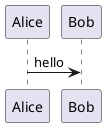
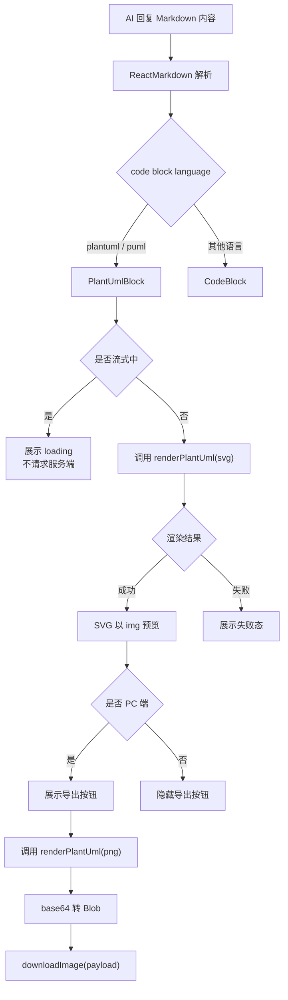
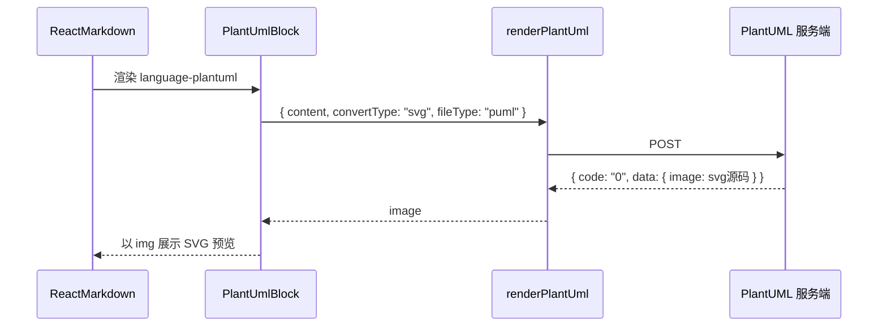
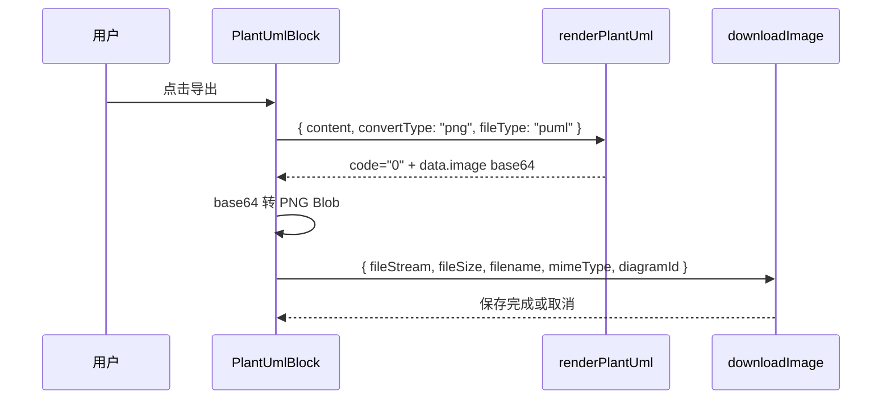

# PlantUML Markdown 服务端渲染技术方案

- 方案日期：`2026-06-05`
- 目标工程：`ai-chat-viewer`
- 参考文档：
  - [`docs/plans/技术方案模板.md`](./plans/技术方案模板.md)
  - [`docs/2026-06-03-mermaid-markdown-render-export-design.md`](./2026-06-03-mermaid-markdown-render-export-design.md)
  - [`docs/plantUML.md`](./plantUML.md)
  - [`docs/weAgentCUI-ai-reply-rendering.md`](./weAgentCUI-ai-reply-rendering.md)
- 方案类型：`前端 Markdown 渲染能力增强`

## 1. 背景

### 1.1 场景说明

当前 `ai-chat-viewer` 已支持 Markdown 文本、代码块、表格和公式渲染。AI 回复中可能输出 PlantUML 代码块：

````markdown

````

现状会按普通代码块展示，无法直接看到 UML 图。PlantUML 不适合在当前 SDK 前端内纯本地渲染，因此本方案采用服务端接口渲染，前端只负责识别 Markdown、调用注入的渲染方法、展示图片和 PC 导出。

### 1.2 需求目标

1. 支持 Markdown fenced code block 中的 `plantuml` / `puml` 渲染为图表。
2. PlantUML 渲染由服务端 POST 接口提供，前端不引入 PlantUML 重型依赖。
3. 服务端入参为 `{ content, convertType: 'svg' | 'png', fileType: 'puml' }`。
4. 服务端返回结果为 `{ code: "0", messgaeCn: "", messageEn: "", data: { image: "" } }`，其中 `code === "0"` 代表正常，其他值代表异常；`messgaeCn` 是中文消息，`messageEn` 是英文消息；SVG 返回源码，PNG 返回 base64。
5. 流式输出期间不触发渲染，内容稳定后再请求服务端。
6. 预览默认请求 SVG，PC 导出时请求 PNG 并复用现有下载能力。
7. 非 PC 端不展示导出入口。
8. 渲染失败、服务缺失、返回空图片时展示国际化失败态，不展示 PlantUML 源码和错误堆栈。

### 1.3 非目标

1. 不新增或修改消息协议字段。
2. 不实现 PlantUML 编辑器、语法补全、源码区、手动缩放、拖拽平移、PDF 导出。
3. 不使用公网 PlantUML Server，不在前端内置固定服务地址。
4. 不在移动端提供导出入口。
5. 不把 SVG 源码直接插入 DOM。

## 2. 方案图

### 2.1 整体方案图



### 2.2 方案核心

核心方案是在现有 Markdown code renderer 层识别 `plantuml` / `puml`，路由到 `PlantUmlBlock`。组件通过 `MarkdownRuntimeConfigContext` 获取运行时注入的 `renderPlantUml`、`downloadImage`、`isStreaming`、`isPc`，保持 `ReactMarkdown components` 静态稳定。

## 3. 时序图

### 3.1 稳定消息预览渲染



### 3.2 PC 导出图片



## 4. 技术细节

### 4.1 调整点

1. 新增 `PlantUmlBlock` 组件，负责 loading、预览、失败态、PC 导出。
2. 新增 `MarkdownRuntimeConfigContext`。
3. 扩展 `createMarkdownComponents(true)`，识别 `language-plantuml` / `language-puml`。
4. 增加 PlantUML 运行时类型：`PlantUmlRenderParams`、`PlantUmlRenderHandler`。
5. `AppProps`、`SkillCUIProps` 增加 `renderPlantUml` 可选参数，并向下透传。
6. 增加 `createPlantUmlHttpRenderer(endpoint)` 工具，供宿主用固定 endpoint 快速创建注入方法。
7. 增加 PlantUML i18n 文案和样式文件。
8. PC 导出复用 `downloadImage` 与 Pedestal 文件保存公共方法。

### 4.2 核心实现方式

服务端接口模型：

```ts
export interface PlantUmlRenderParams {
  content: string;
  convertType: 'svg' | 'png';
  fileType: 'puml';
}

export interface PlantUmlRenderResult {
  image: string;
}

export interface PlantUmlRenderResponse {
  code: '0' | string;
  messgaeCn: string;
  messageEn: string;
  data: PlantUmlRenderResult;
}

export type PlantUmlRenderHandler = (
  params: PlantUmlRenderParams,
  options?: { signal?: AbortSignal },
) => Promise<PlantUmlRenderResult>;
```

默认 HTTP 渲染器：

```ts
createPlantUmlHttpRenderer(endpoint: string): PlantUmlRenderHandler
```

该方法内部使用 POST 请求，body 为 `PlantUmlRenderParams`，先校验响应 `code` 是否为字符串 `"0"`；异常时根据当前页面语言选择错误消息，英文环境优先使用 `messageEn`，其他环境优先使用 `messgaeCn`；成功后读取 `data.image`。

### 4.3 兼容与边界

1. `ReactMarkdown components` 继续使用空依赖 `useMemo`，动态状态只通过 Context 传递。
2. `ToolCard` 内 Markdown 继承父级 `renderPlantUml/downloadImage/isPc`，只覆盖自身流式状态。
3. `ThinkingBlock` 首期不启用 PlantUML 渲染。
4. SVG 预览使用 `Blob + URL.createObjectURL + img`，不使用 `dangerouslySetInnerHTML`。
5. PNG base64 同时兼容纯 base64 与 `data:image/png;base64,...`。
6. 缺少 `renderPlantUml` 时显示失败态，不回退展示源码。
7. 组件卸载、内容变化、请求过期时取消或忽略旧请求。
8. 渲染缓存上限 50 项，避免长会话无限增长。

### 4.4 相关接口联动

1. PlantUML 服务端渲染接口：POST。
2. 入参固定为 `{ content, convertType, fileType: 'puml' }`。
3. 出参固定校验 `code === "0"` 后读取 `data.image`。
4. PC 下载接口沿用 `downloadImage(payload)`。
5. 宿主通过 `AppProps` / `SkillCUIProps` 注入 `renderPlantUml`。

### 4.5 文档需要同步修改的内容

1. 新增本文档。
2. 更新 `docs/weAgentCUI-opencode-cases.md`，补充 PlantUML 预览和导出 case。
3. PC 文件下载公共方法同步落地为 `downloadFileWithPedestal`。

## 5. 性能

PlantUML 不增加前端包体积；预览只在内容稳定后发起一次 SVG 请求。相同内容通过缓存复用结果。流式期间不请求服务端，避免半截语法导致频繁失败和额外网络消耗。

## 6. 功耗

不新增轮询、长连接或后台任务。只在图表块进入稳定渲染、用户点击导出时发起请求。loading 动画采用轻量三点动画，影响可忽略。

## 7. 埋码

1. `plantuml_render_success`
   - 说明：可选，记录 SVG 渲染成功。
2. `plantuml_render_failed`
   - 说明：可选，记录渲染失败原因分类，不记录源码内容。
3. `plantuml_export_clicked`
   - 说明：可选，记录 PC 导出按钮点击。

首期不新增埋码；如业务需要分析服务端渲染质量，再单独接入。

## 8. 影响范围

### 8.1 直接影响

1. `src/components/markdownComponents.tsx`
2. `src/components/MessageBubble.tsx`
3. `src/components/ToolCard.tsx`
4. `src/components/Content.tsx`
5. `src/types/components/chat.ts`
6. `src/types/pages/assistant.ts`
7. `src/i18n/resources/zh.ts`
8. `src/i18n/resources/en.ts`

### 8.2 间接影响

1. UMD library 消费方可选择注入 `renderPlantUml`。
2. PC 保存文件能力由公共方法 `downloadFileWithPedestal` 承接。
3. Tool 输出中的 Markdown 会同步具备 PlantUML 预览能力。

### 8.3 不影响

1. 不影响消息协议、流式组装、历史消息转换。
2. 不影响普通代码块渲染。
3. 不影响 Markdown raw HTML 现有能力边界。
4. 不影响 Mermaid 方案的本地渲染策略。

## 9. 测试范围

### 9.1 功能测试

1. `plantuml` 代码块成功请求 SVG 并展示图片。
2. `puml` 代码块行为一致。
3. 流式输出期间不请求服务端，结束后再渲染。
4. 服务端失败、空 `data.image`、缺少 `renderPlantUml` 时展示失败态。
5. PC 端导出请求 PNG，base64 正确转 Blob 并调用 `downloadImage`。
6. 非 PC 端不展示导出按钮。
7. 同一条消息多个 PlantUML 块互不覆盖。

### 9.2 兼容测试

1. WeAgentCUI 与 SkillCUI 均可通过 props 注入渲染器。
2. UMD library 构建后宿主可使用 `createPlantUmlHttpRenderer`。
3. ToolCard 内 PlantUML 继承父级运行时配置。
4. 移动端预览可用，导出入口隐藏。

### 9.3 文档一致性检查

1. 检查方案中的接口字段与服务端约定一致，尤其是 `code` 字符串、中文字段 `messgaeCn` 和英文字段 `messageEn`。
2. 检查 Mermaid 方案中的 Context、下载、流式约束被一致复用。
3. 检查测试 case 覆盖预览、失败、流式、导出、非 PC 隐藏入口。

## 10. 最终建议

推荐采用“运行时注入 PlantUML 渲染器 + 服务端 SVG 预览 + PC 端 PNG 导出 + Markdown Context 传递”的方案。该方案不增加前端重型依赖，适合当前 ES5/UMD SDK 构建约束，也能让不同宿主自由决定 PlantUML 服务端 endpoint。
